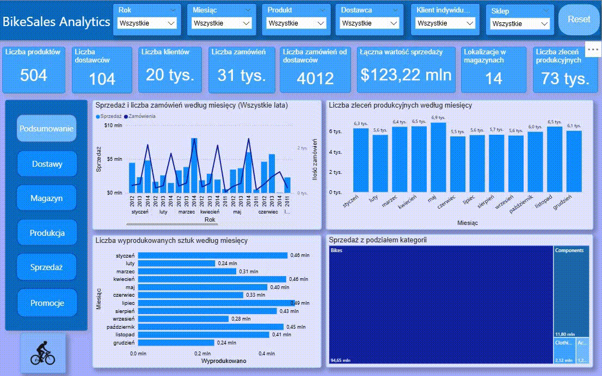
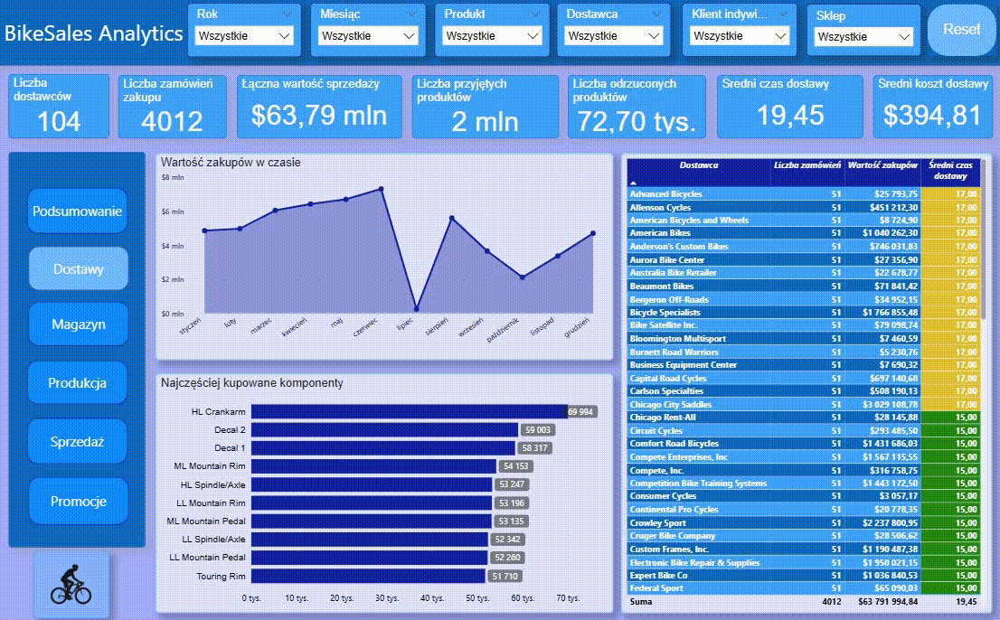
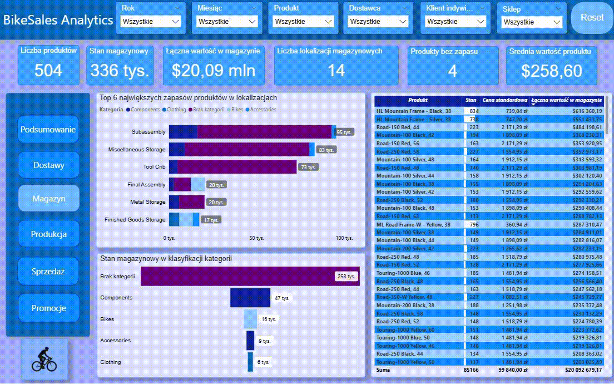
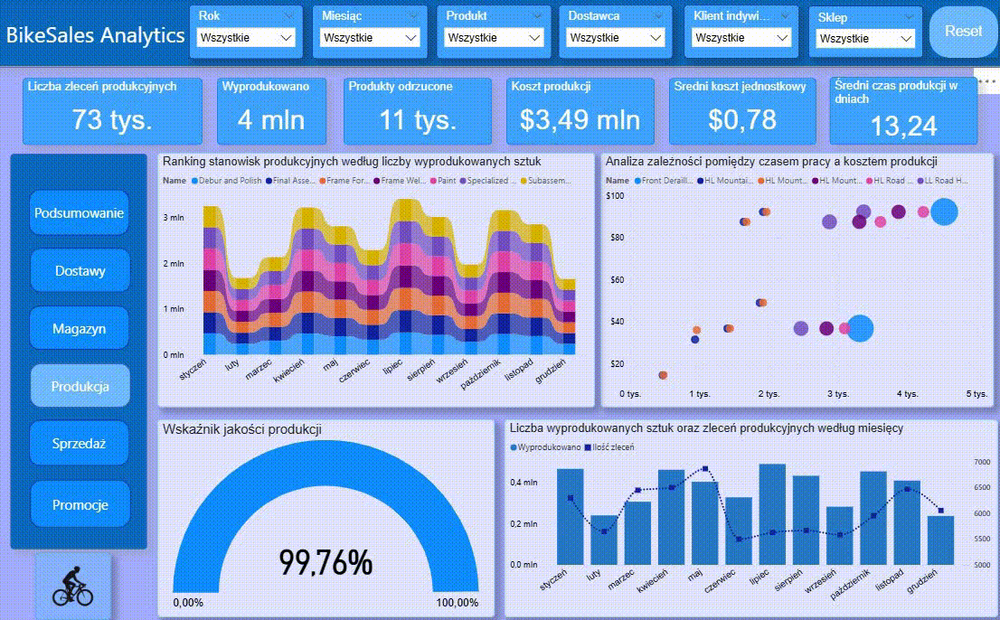
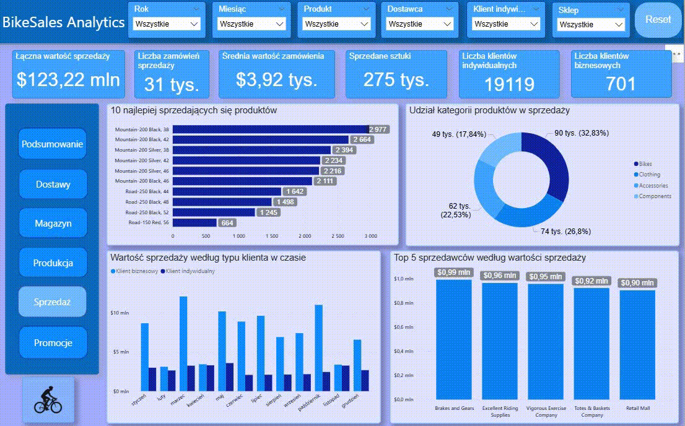
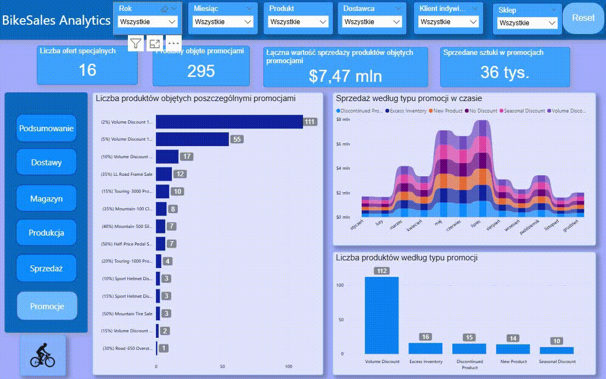

## AdventureWorks-Database-Analysis

### AdventureWorks SQL - Analiza procesów biznesowych
Projekt przedstawia kompleksową analizę bazy danych AdventureWorks z wykorzystaniem języka SQL. Celem projektu jest odwzorowanie rzeczywistych procesów zachodzących w przedsiębiorstwie produkcyjno-handlowym, czyli 
od zakupu komponentów u dostawców, przez magazynowanie i produkcję, aż po sprzedaż produktów klientom oraz analizę promocji.

### Zakres projektu
- Analiza dostawców i zamówień zakupu
- Zarządzanie magazynami oraz stanami produktów
- Proces produkcyjny i struktura produktów (Bill of Materials)
- Analiza kosztów produkcji
- Historia transakcji magazynowych
- Analiza sprzedaży i zamówień klientów
- Analiza klientów oraz sklepów
- Analiza promocji i ofert specjalnych

Wykorzystane technologie
- Microsoft SQL Server
- AdventureWorks Database

Cel projektu

Projekt pokazuje, w jaki sposób relacyjna baza danych może wspierać analizę procesów biznesowych przedsiębiorstwa oraz umożliwiać pozyskiwanie informacji niezbędnych do podejmowania decyzji na podstawie danych.

Szczegółowa dokumentacja projektu została opracowana w pliku PDF pt. "Analityczny model ERP_WMS oparty na bazie AdventureWorks", zawierającym opis struktury bazy danych, analizowanych modułów oraz wszystkich wykonanych zapytań SQL wraz z ich interpretacją.

### Dashboard Power BI
Projekt został rozszerzony o interaktywny dashboard wykonany w Microsoft Power BI, którego celem jest wizualizacja i analiza danych zgromadzonych w bazie AdventureWorks. Dashboard przedstawia pełny proces funkcjonowania przedsiębiorstwa produkcyjno-handlowego, od zakupu komponentów, poprzez magazynowanie i produkcję, aż do sprzedaży produktów oraz analizy promocji.

Raport został podzielony na sześć głównych sekcji:
- Podsumowanie - najważniejsze wskaźniki KPI oraz analiza sprzedaży i produkcji w czasie,

- Dostawy - analiza dostawców, wartości zakupów oraz czasu realizacji dostaw,

- Magazyn - poziom zapasów, wartość magazynu oraz rozmieszczenie produktów,

- Produkcja - analiza zleceń produkcyjnych, wydajności oraz jakości procesu produkcyjnego,

- Sprzedaż - analiza sprzedaży według klientów, produktów i kategorii,

- Promocje - skuteczność ofert specjalnych, wartość sprzedaży oraz wykorzystanie promocji.

Dzięki zastosowanym wizualizacjom możliwa jest szybka identyfikacja trendów, analiza efektywności procesów biznesowych oraz podejmowanie decyzji na podstawie danych.

Szczegółowy opis zastosowanych miar, wizualizacji oraz interpretacja wyników zostały przedstawione w raporcie PDF "AdventureWorksPowerBI".
